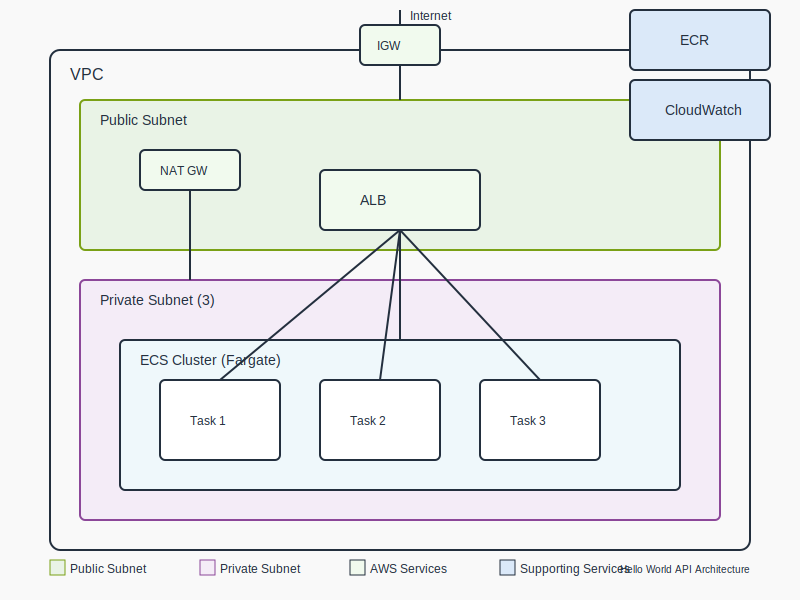

# Hello World API

This project demonstrates a simple REST API deployed on AWS using Terraform.

## Project Overview

- **API Application**: A FastAPI application that exposes hello world endpoints
- **Infrastructure**: AWS environment built with Terraform using ECS Fargate

## Architecture

## Project Structure

- [`app/`](app/README.md) - Contains the FastAPI application code and Dockerfile
- [`infrastructure/`](infrastructure/README.md) - Contains the Terraform code for AWS deployment
- [`docs/`](docs/architecture.svg) - Architecture diagram

## Getting Started

1. First, build and test the API locally - see [app README](app/README.md)
2. Then, deploy to AWS using Terraform - see [infrastructure README](infrastructure/README.md)
